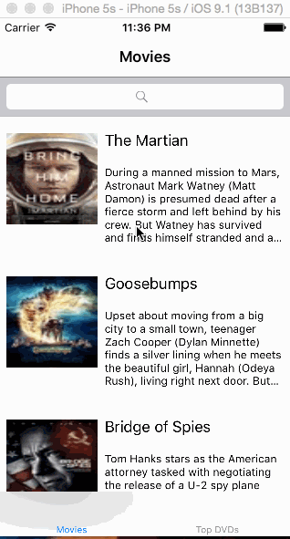

# Rotten-Tomatoes
This is an Android demo application for displaying the latest box office movies using the RottenTomatoes API. See the RottenTomatoes Networking Tutorial on our cliffnotes for a step-by-step tutorial.

Time spent: 10 hours spent in total

Completed user stories:

[Required] User can view a list of movies from Rotten Tomatoes. Poster images must be loading asynchronously.

[Required] User can view movie details by tapping on a cell.

[Required] User sees loading state while waiting for movies API

[Required] User sees error message when there's a networking error. You may not use UIAlertView or a 3rd party library to display the error.

[Required] User can pull to refresh the movie list. 

Walkthrough of all user stories:

